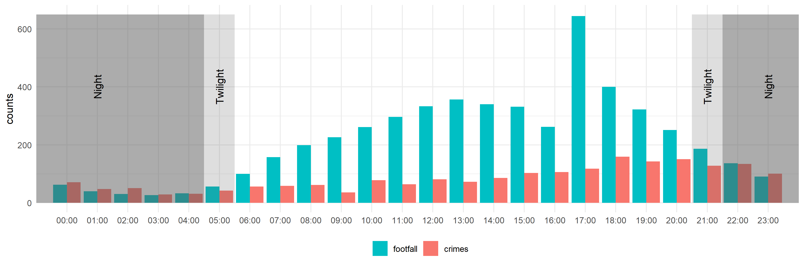

```{r setup, include=FALSE}
knitr::opts_chunk$set(echo = FALSE)
library(readr); library(kableExtra)
```

## Background

We know that crowded environments can be unsafe. For instance, crime levels increase in and around sports stadiums when attendees flock to attend events [@kurland2014offenses]. Facilities which attract high ambient populations, such transit nodes (e.g. bus stations), are known to produce criminogenic hotspots [@ceccato2015geography]. Crowding on street corners has been found to facilitate pickpocketing [@levine1986crime], and in the reverse causal direction, _restrictions_ on crowding and population mobility have been identified as the leading cause of the crime drop witnessed during the COVID-19 pandemic lockdown [@halford2020crime].

That said, the relationship is not clear-cut. While transit stations might be criminogenic places on aggregate, there is considerable temporal variation to these patterns [@irvin2015spatio]. Passengers often feel most safe, and at a minimal risk of being victimized, when public transport is busy [@newton2004crime]. Out on the street, pedestrians passing-by potential targets can create 'eyes on the street' which deter victimization and reduce criminal opportunity [@cozens2011urban]. The density of pedestrians in public spaces has been found to decrease fear of crime, but only to a threshold, at which point pedestrian density can be detrimental to feelings of safety [@tchinda2020paradox].

The notion that crowding impacts on human behavior is not new, and it is certainly not restricted to geography or criminology disciplines. The impact of crowding on human behavior has been examined in psychology for some time [@freedman1975crowding; @stokols1972distinction]. Here, findings point towards a potential relationship with crime. For instance, the invasion of private space (e.g. high crowd density, crossing someone's path) has been found to prompt negative emotional responses, such as aggression [@engelniederhammer2019crowding]. This might insight criminal acts such as assault. In policing and event management, unsuitable interior architecture (e.g. poorly placed exit and entry doors) in nightclubs has been found to produce sub-optimal pedestrian flows, which in turn facilitate overcrowding and aggressive behavior [@macintyre1997danger].

To contribute to this growing (but incomplete) evidence-base, we organized an online event, bringing together students and researchers from a diverse array of backgrounds and academic disciplines. Exploiting novel sources of open data, we organized a hackathon event ‘Exploring the Relationship between Crowds, Safety and Crime’ in collaboration with the University of Manchester and the International Association of Traffic Safety Sciences. In this paper, we summarize the design, format and key findings from this event to (1) actively contribute to scientific advancement in the field, and (2) provide a 'proof of concept' for wider usage in crime and safety research.

## Hackathon

### Design

The hackathon was held over two days in December, 2020. Due to COVID-19 social distancing measures the event was hosted online using the Zoom conferencing platform. We advertised the hackathon through mailing lists and social media in the weeks prior. No costs were charged to attendees and we explicitly stated that the event was open to a diverse array of professions (i.e. academic and non-academic), disciplines and experience in data-driven research. Between 25 and 30 participants attended the event throughout the two days. Most attendees were from higher education institutes in the United Kingdom, although the online platform did encourage some international participants from Malaysia and observers from International Association of Traffic Safety Sciences (IATSS) in Japan. Participants' experience range from a high school pupil to senior academic staff, and the disciplines represented included geography, psychology, environmental design, criminology and data science.

We designed the programme so that the hackathon served as both a substantive research activity and an educational tool for participants. The educational component included a range of parallel workshops which people could choose from, including introduction to Application Programming Interfaces (API), introduction to Python, introduction to R, access to open police-recorded crime data, and an introduction to GitHub and version control. Two guest speakers provided lectures on topics on their respective expertise, namely, Dr Taku Fujiyama on crowding, traffic density and safety, and Dr Andrew Newton on theoretical and empirical research on 'busyness' from a crime and place perspective. These activities served to extend attendees' existing expertise, but also to ensure that less experienced participants could actively contribute to the hackathon.

For the research component, attendees were divided into teams according to their research background. Prior to the hackathon, those who registered were sent a questionnaire to gauge their research interests and experience with software (e.g. GIS, R). Three teams were manually selected to ensure diversity and balance based on these answers. Each team was tasked with exploring the topic of 'crowds, safety and crime'. We let groups pick their own research questions, drawing upon their own research backgrounds and inspired by the educational workshops and guest lectures during the hackathon.

### Data

To assist the teams in answering their research questions we provided a series of datasets via an open Dropbox link. These data were collated and processed specifically for usage during the hackathon, and offered a unique opportunity for participants to produce novel findings. The datasets are summarized in Table 1. When appropriate, we also provided participants with access to the R script used to pre-process the data, so that attendees could check or amend the raw data for their own purposes.

#### Crowding measures

A key challenge was to ensure that participants had access open measures of 'crowding' which could then be matched with open data on crime and safety. We sourced our measures for crowding from two datasets: Retrosheet and Safegraph. Retrosheet is an open online database containing gamelogs on historical Major League Baseball games. These logs include relevant information including: date of the game, time of the game, the away team, the home team, the host stadium, the winner, the length of the game, and perhaps most importantly, the attendance figure for the game. The game attendance figure thus provides a measure of crowding around a specific stadium on a specific day. Although game logs go back to 1871, we subsetted the 2018 simplicity and to ensure a match with the open crime described in the next section.

Safegraph is a company which provides geospatial data on Points of Interest and measures of footfall, primarily in the United States and Canada. Subsets of their _neighbourhood patterns_ dataset are openly available, containing information on footfall counts at census block group level in June, 2020. A number of measures of footfall are available based on individual 'pings' from mobile phone devices, including the number of pings by day and by hour for the whole month (i.e. 720 measurements) in each census block group. We subsetted this data to Los Angeles for computational ease, and to ensure a match with the crime data.

#### Crime measures

To facilitate a match between the measures of 'crowds' and crime and safety, we provided attendees with access to open police-recorded crime data. Open police data in the United States is unique in terms of its spatial and temporal accuracy. Two sources were used. First, geocoded police-recorded crime data in Los Angeles for the month of June, 2020. This could be aggregated to the census block group level and merged with the Safegraph data on footfall. Second, a subset of police-recorded crime data for 2018 obtained using the `crimedata` R package [@ashby2019studying; @ashby2018crime]. This dataset included crime data on 16 major cities in the United States, and thus provided reasonable coverage of Major League Baseball match host cities in the Retrosheet data.

```{r data, warning=F, message = F}
data_df <- read_csv("data/data_sources.csv")
data_kable <- kable(data_df,
                        caption = "Summary of data provided to participants",
                        booktabs = T, longtable = T, linesep = "\\addlinespace", format = "latex") %>%
    kable_styling(latex_options = c("repeat_header", "striped"), font_size = 9, full_width = F) 
column_spec(data_kable, c(1,2), width = c("8cm", "5cm"))
```

#### Supplementary data

A number of small supplementary data files were provided to participants to provide support. These included (1) a file containing the latitude-longitude coordinates of the host baseball stadiums in the Retrosheet data; (2) a shapefile of census block groups in California; (3) a list of census block group identification codes for the city of Los Angeles.

## Research outputs

Each team approached the research component of the hackathon uniquely. This demonstrated the benefits of choosing teams based on the diversity of research backgrounds, and highlighted the depth and complexities of the topic. We showcase the outputs of each team in turn.

### Team 1

### Team 2

The second team focused on crime during match days for the LA Dodgers. They hypothesised that, not only would attendance correlate with crime, but that the _result_ of the game (i.e. whether the LA Dodgers won or not) would factor into this relationship. The team also expected this relationship to vary by crime type, reflecting the unique opportunity structures of different offences. For instance, a an LA Dodgers loss may result in higher rates of disorderly conduct or assault, whereas crimes like motor vehicle theft may be unaffected by the game result.

Findings suggested that more crime occurred in and around the LA Dodgers stadium on match days compared to non-match days, particularly for assault and disorder. There was some evidence to suggest that crime was _higher_ on game days, although this relationship was not clear. Overall, higher game attendance was associated with less crime, both in and around the stadium, but also in Los Angeles as a whole. This suggests that, although games appear to elevate crime in the area, the crowding brought about by high attendance may act as a deterrent.

### Team 3

Team 3 used the Safegraph data to explore the spatial and temporal relationship between vehicle crime and footfall in Los Angeles. The team hypothesised that higher footfall (i.e. crowding) would be associated with elevated vehicle crime due to the anonymity of crowds. Specifically, the team expected a lagged relationship: that an increase in crowds during time point _t_ would be associated with an increase in vehicle crime during _t+1_.

The team found a temporal variation in vehicles crimes, and there was some evidence to suggest an association with crowding. Vehicle crime counts appeared to increase as the day progressed, peaking during the afternoon rush hour, before declining into the late evening. 

```{r team3, fig.pos = 'H', fig.align='center', message=F, comment=F, warning=F, fig.cap = "Example visual produced by Team 3 during the hackathon using Safegraph footfall data and open police-recorded crime data on vehicle crimes.", out.width = "90%"}

```


# Discussion

- A key outcome from the hackathon was the discussion and ideas that came from these preliminary analyses.
- One thing that is yet to be exploited is the crowd _density_ measure rather than simply a measure of people counts in an area.
- There is important theoretical justification for this.

# Conclusions

We believe that this Open Research format could be used widely. Use of open data as well as collaborative working on the internet would remove barriers attached to traditional collaborative research.  

# References