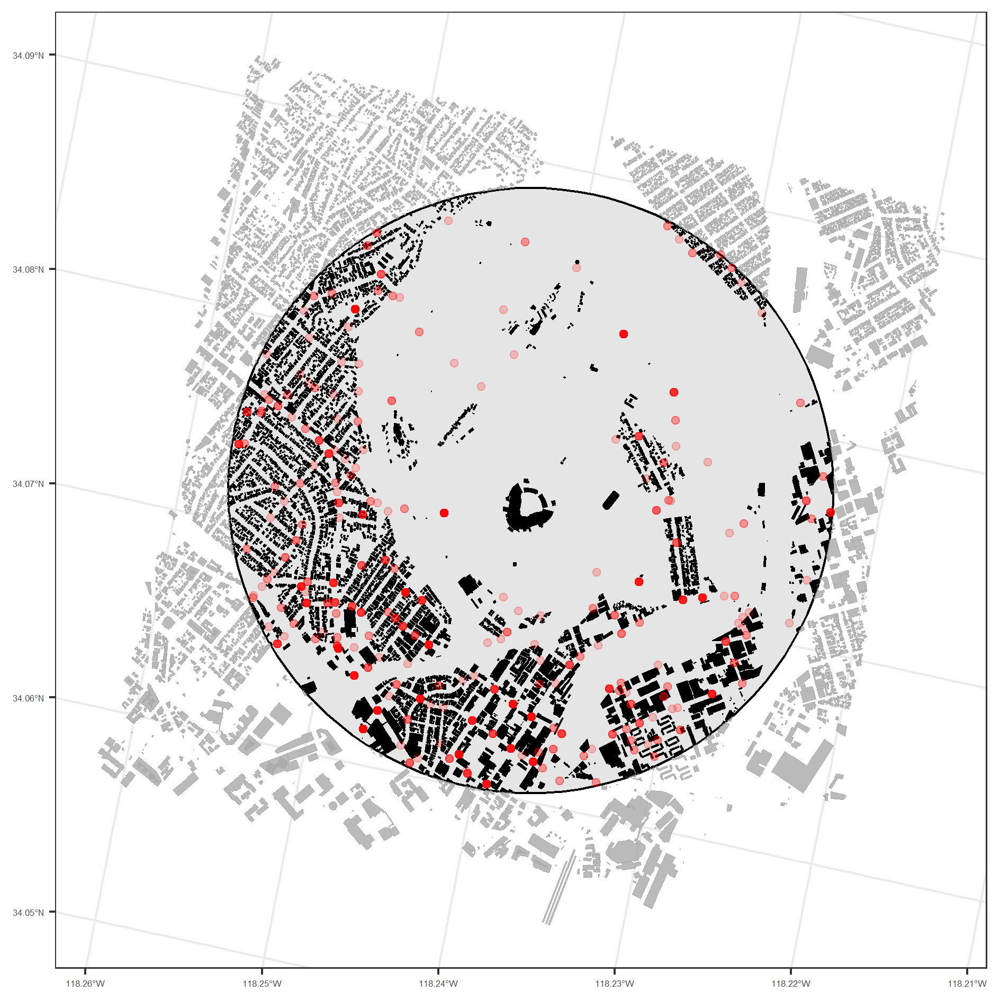
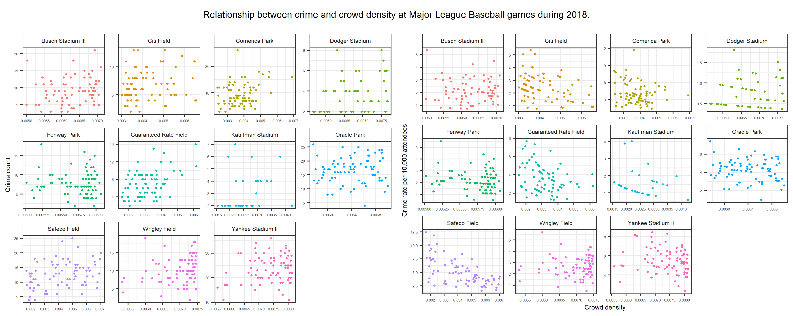

```{r setup, include=FALSE}
knitr::opts_chunk$set(echo = FALSE)
```

# Background

- Issues around overcrowding and crime in urban environments has been acknowledged for some time [@freedman1975crowding].
- Evidence suggests that the more 'strangers' in an area, the more crime trends to occur, although this can vary by crime type [@jarrell1990transient].
- Overcrowded areas, such as around public transport stops, are thought to mask deviant behaviour and thus provide opportunities for crime [@loukaitou1999hot].
- Existing studies have found that sports events, such as baseball games, can incite criminal behaviour, especially around the immediate vicinity of the stadium [@mares2019major].
- Here, we demonstrate how to examine the relationship between crowd density and crime at Major League Baseball games during 2018 using open data sources.

# Data

- Open Street Map API.
- Open police-recorded crime data [@ashby2018crime].
- Game logs from Retrosheet.

# Preliminary findings

- There is evidence of a relationship between game crowd attendance and crime.
- To give a meaningful interpretation, we adjust attendance figures for the built environment, providing a measure of crowd density.
- This demonstrates that there is a positive association between crowd density and the volume of crime occurring in and around stadiums on match days, although this does seem to vary by stadium.
- There is a negative association between crowd density and crime _rates_ (adjusted for attendees), noting potential issues around rate measure. Again, this does seem to vary by stadium.
- Visual inspection of geocoded crime locations suggests that match day crimes tended to occur in enclosed urban spaces (e.g. between buildings) in which crowd density would be higher, rather than open spaces (e.g. car park surrounding stadium) where people would be spread out. This would benefit from further analysis and comes with the caveat of geocoding inaccuracies in police records [@ashby2018crime].

```{r lamap, fig.pos = 'H', message=F, comment=F, warning=F, fig.cap = "Building footprints around the LA Dodger stadium including 1-mile buffer and geocoded crime locations on match days during 2018."}

```

```{r facet, fig.pos = 'H', message=F, comment=F, warning=F, fig.cap = "Relationship between crowd density and crime (counts and rates) by stadium for Major League Baseball match days during 2018."}

```

# Discussion

- We provide a demonstration of how to use open data to examine the relationship between overcrowding and crime at sports events.
- There is preliminary evidence to suggest that there is a relationship between crowd density and crime around Major League Baseball games on match day.
- The variation by stadium indicates that other factors in the urban environment might be determining criminal behaviour, or mediating the relationship between overcrowding and crime (e.g. crowd control, alcohol sales, time of game).
- Future research might also consider comparing games at _different stadiums_ (thus different building footprints) that had a _similar attendance_ figure. This would help unpick the relationship between overcrowding and crime.
- All code to replicate this study can be found online (https://github.com/langtonhugh/crowds_crime).

# References